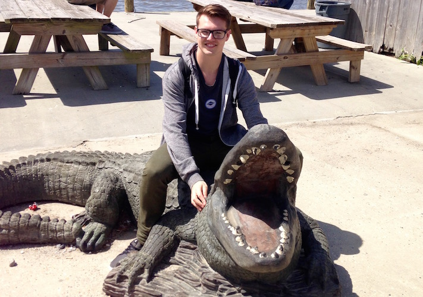

Currently, I am a graduate student studying cognitive neuroscience. Most of the time, I research human reasoning, executive impairments following traumatic brain injury, and multivariate statistics. When I get home from school, I enjoy reading, fishing, and anything/everything that revolves around hockey...especially the Blackhawks! As I begin to grow my blog, I will be focusing on several aspects, including hockey analytics, academics, and my professional achievements.

Recent Blog Posts:

<article>
<h3><a href="testblog.html">TEST BLOG</a></h3>

<i class="fa fa-calendar"></i>13 June 2017

A quick summary of the post

<a class="btn btn-outline-primary btn-sm" href="testblog.html">Full Post</a>

</article>

