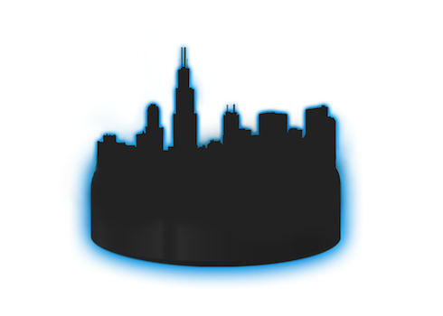

<h4>Matthew J. Kmiecik</h4>
<ul class="nav nav-pills nav-stacked">
<li class="active"><a href="#section1">Home</a></li>
<li><a href="#section2">Friends</a></li>
<li><a href="#section3">Family</a></li>
<li><a href="#section3">Photos</a></li>
</ul> 

<input type="text" class="form-control" placeholder="Search Blog..">

<button class="btn btn-default" type="button">

</button>

<h4><small>Portfolio</small></h4>

<h2>I Love Food</h2>
<h5> Post by Jane Dane, Sep 27, 2015.</h5>
<h5>Food Ipsum</h5> 

Food is my passion. Lorem ipsum dolor sit amet, consectetur adipiscing elit, sed do eiusmod tempor incididunt ut labore et dolore magna aliqua. Ut enim ad minim veniam, quis nostrud exercitation ullamco laboris nisi ut aliquip ex ea commodo consequat. Excepteur sint occaecat cupidatat non proident, sunt in culpa qui officia deserunt mollit anim id est laborum consectetur adipiscing elit, sed do eiusmod tempor incididunt ut labore et dolore magna aliqua. Ut enim ad minim veniam, quis nostrud exercitation ullamco laboris nisi ut aliquip ex ea commodo consequat.

  

<h4><small>RECENT POSTS</small></h4>

<h2>Officially Blogging</h2>
<h5> Post by John Doe, Sep 24, 2015.</h5>
<h5>Lorem</h5> 

Lorem ipsum dolor sit amet, consectetur adipiscing elit, sed do eiusmod tempor incididunt ut labore et dolore magna aliqua. Ut enim ad minim veniam, quis nostrud exercitation ullamco laboris nisi ut aliquip ex ea commodo consequat. Excepteur sint occaecat cupidatat non proident, sunt in culpa qui officia deserunt mollit anim id est laborum consectetur adipiscing elit, sed do eiusmod tempor incididunt ut labore et dolore magna aliqua. Ut enim ad minim veniam, quis nostrud exercitation ullamco laboris nisi ut aliquip ex ea commodo consequat.

<h4>Leave a Comment:</h4>
<form role="form">

<textarea class="form-control" rows="3" required></textarea>

<button type="submit" class="btn btn-success">Submit</button>
</form>
  

2 Comments:
 

<section class="portfolio">

<h3>The Blue Line</h3>

My hockey analytics blog where I post some of my hockey analyses with R code

<h3>Academic Blog</h3>

A blog about all things R, cognitive neuroscience, and statistics

<h3>Curriculum Vitae</h3>

My publications and conference participation

</section>

Recent Blog Posts:

<article>
<h3><a href="testblog.html">TEST BLOG</a></h3>

<i class="fa fa-calendar"></i>13 June 2017

A quick summary of the post

<a class="btn btn-outline-primary btn-sm" href="testblog.html">Full Post</a>

</article>

