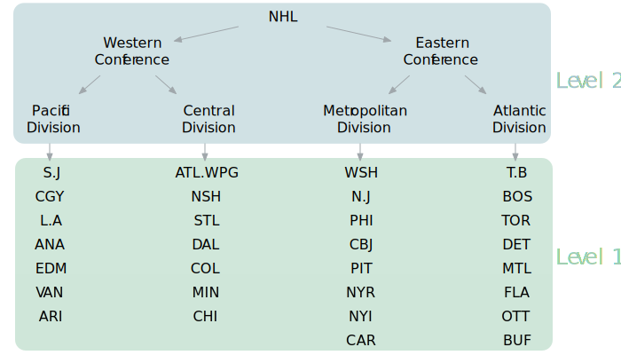

```{r setup, include=F}
knitr::opts_chunk$set(echo = TRUE, fig.align = 'center')
options(knitr.table.format = 'html') # For the html tables
```

## Introduction
<hr >

In a [previous post](https://mattkmiecik.com/post-The-Last-Decade-NHLs-Best-and-Worst-Power-Play-Teams.html), I was interested in determining if there were any fluctuations in the frequency of powerplay goals (5 on 4) in the NHL across one decade (2007-2017). The statistial technique of choice was linear regression.

However, there were a few issues with this statistical modeling procedure:

1. This model did not account for the variability within each team. In other words, the model did not appreciate each team's change in powerplay goals across time individually. When we do not account for this variability (within-team variance), the unsystematic error is seemingly reduced, and subsequently an increase in our test statistic, decrease in p-value, and ultimately an increase in Type I error rate
2. Time was treated as a factor (i.e., categorical variable). However, time is actually a continuous construct and may reveal more informaton when treated as such

> I had a feeling something was off here. So, I turned to one of my fellow classmates, Ekarin Pongpipat, to teach me a technique that could remedy this situation. The following is what we produced after two Saturday afternoons! Thanks again Ekarin!

To improve this model of NHL 5v4 powerplay goals, we utilized a multi-level linear regression model. The purpose of this post is three-fold:

1. Create a more accurate model of NHL powerplay goal fluctuations across the 2007-2017 decade
2. Explore these data with plenty of plots
3. Provide a tutorial of multi-level linear modeling in R

## Setup
<hr >

Let's first load some useful packages for analysis and plotting:

```{r packages, message=F}
library(tidyverse); library(RCurl); library(broom); 
library(gridExtra); library(knitr); library(kableExtra);
library(RColorBrewer)
```

These data were retrieved via [Corsica](http://corsica.hockey/) shortly after the end of the 2017 regular season and are also available on this [website's Github repository](https://github.com/mkmiecik14/mkmiecik14.github.io). Feel free to pull these data from the repository like this:

```{r data}
link <- 'https://raw.githubusercontent.com/mkmiecik14/mkmiecik14.github.io/master/data/corsicaData_5v4.csv'
data5v4 <- read.table(text = getURL(link), sep = ',', header = T)
```

The Atlanta Thrashers moved to Winnipeg (Jets) after the 2011 season. Therefore, we combined the entries of the Atlanta Thrashers and the Winnipeg Jets. **The Thrashers and the Jets are considered the same team in this analysis.**

```{r cleanup}
# Combining ATL and WPG as ATL.WPG
data5v4$Team <- plyr::revalue(data5v4$Team, c(ATL = 'ATL.WPG', WPG = 'ATL.WPG'))
```

For the regression models, it is more desirable to have the year be represented as a continuous variable. This way an increase of 1 year is the equivalent of 1 year of hockey played. This will translate to more interpretable regression coefficents. Year was recoded as the starting year of the season (e.g., 20162017 = 2016):

```{r year}
data5v4 <- data5v4 %>% 
            separate(Season, c('StartYear', 'EndYear'), sep = 4, remove = F) %>%
            mutate_at(c('StartYear', 'EndYear'), funs(as.numeric))
```

Next, we coded each team into its division following the 2013-2014 realignment scheme. 

**Note: This has serious implications for our later analysis of conference and divisions. This realignment took place 6 years from the first season in this analysis. Therefore, identifying the teams using this realignment scheme is used for illustrative purposes.**

```{r div}
# Initializing variables to store team names
pacific <- c('S.J', 'CGY', 'L.A', 'ANA', 'EDM', 'VAN', 'ARI')
central <- c('ATL.WPG', 'NSH', 'STL', 'DAL', 'COL', 'MIN', 'CHI')
metropolitan <- c('WSH', 'N.J', 'PHI', 'CBJ', 'PIT', 'NYR', 'NYI', 'CAR')
atlantic <- c('T.B', 'BOS', 'TOR', 'DET', 'MTL', 'FLA', 'OTT', 'BUF')

# Creating a column to identify each team's division
data5v4 <- data5v4 %>%
  mutate(division = case_when(data5v4$Team %in% pacific ~ 'Pacific',
                              data5v4$Team %in% central ~ 'Central',
                              data5v4$Team %in% metropolitan ~ 'Metropolitan',
                              data5v4$Team %in% atlantic ~ 'Atlantic'))
```

Here is a table detailing the 2013 realignment:

```{r divTable}
# Creates the data frame for html table
divisions <- data.frame(Pacific = c(pacific, ''),
                        Central = c(central, ''),
                        Metropolitan = metropolitan,
                        Atlantic = atlantic)

# Prints table
kable(divisions) %>%
  kable_styling(bootstrap_options = c('striped', 'hover', 'responsive'))
```

## Data Exploration
<hr >

Before analysis, let's first explore these data via various plots. One question we are interested in is, "Are the amount of standard 5 vs. 4 regular season power play goals changing over time across 10 years (2007-2017) in the NHL?"

```{r vis1}
ggplot(data5v4, aes(StartYear, GF, group = 1)) +
  geom_line(aes(group = Team, color = division), alpha = 2/3) + 
  geom_line(stat = 'summary', fun.y = 'mean', size = .9, color = 'red') +
  scale_color_brewer(palette = 'Blues', direction = -1) +
  labs(x = 'Season (Start Year)',
       y = 'Total Season Power Play Goals (5v4)',
       caption = 'Each team is a separate line; red line is the average') +
  guides(color = guide_legend(title = 'Division')) +
  scale_x_continuous(limits = c(2007, 2016), breaks = c(2007:2016)) +
  theme_minimal()
```

The plot above demonstrates a dramatic decrease in power play goals, league-wide, during the 2012-2013 season. This is clearly a result of the shortened season, which would greatly reduce the amount of powerplay goal attempts, due to the 2012-2013 NHL lockout.

Let's control for this shortended season by dividing the powerplay goals (GF) by the amount of games played (GP) per season:

```{r vis2}
ggplot(data5v4, aes(StartYear, GF/GP, group = 1)) +
  geom_line(aes(group = Team, color = division), alpha = 2/3) + 
  geom_line(stat = 'summary', fun.y = 'mean', size = .9, color = 'red') +
  scale_color_brewer(palette = 'Blues', direction = -1) +
  labs(x = 'Season (Start Year)',
       y = 'Total Season Power Play Goals/Games Played (5v4)',
       caption = 'Each team is a separate line; red line is the average') +
  guides(color = guide_legend(title = 'Division')) +
  scale_x_continuous(limits = c(2007, 2016), breaks = c(2007:2016)) +
  theme_minimal()
```

Now that we've controlled for the number of games played per season, we can see that there seems to be a decrease in the average powerplay goals (red line) scored per season for each subsequent year of play.

Further ways to plot these data include a boxplot and an average trend line:

```{r vis3}
yaxlim <- c(.25,1) # Locks y-axis

# Box plot
boxplot <- ggplot(data5v4, aes(factor(StartYear), GF/GP, group = StartYear)) +
  geom_boxplot() +
  labs(x = 'Season (Start Year)',
       y = 'Total Season Power Play Goals/Games Played (5v4)',
       caption = ' ') +
  coord_cartesian(ylim = yaxlim) +
  theme_minimal()

# Summary for line plot
data5v4_sum <- data5v4 %>% 
  group_by(StartYear) %>% 
  summarise(mean = mean(GF/GP),
            sd = mean(GF/GP),
            n = n(),
            sem = sd/sqrt(n))

# Line plot
lineplot <- ggplot(data5v4_sum, aes(factor(StartYear), mean, group = 1)) +
  geom_line(alpha = 1/3) +
  geom_pointrange(aes(ymax = mean + sem, ymin = mean - sem)) +
  coord_cartesian(ylim = yaxlim) +
  labs(x = 'Season (Start Year)', caption = 'Error bars are SEM') +
  theme_minimal() +
  theme(axis.title.y = element_blank())
  
# Arranges plots side-by-side
grid.arrange(boxplot, lineplot, ncol = 2)
```

## Multi-level Linear Modeling
<hr >

Before we begin modeling these data, let's visualize how these data are structured hierarchically (or in multiple levels).

```{r echo = FALSE, out.width = "100%"}

```

According to this hierarchy, the NHL has two conferences that each have two divisions, each of which have 7 or 8 distinct teams.

We'll first model each team's powerplay performance across 10 years separately in level 1. Then, we'll model these performances between and within each conference and division in level 2.

### Level 1 

The level 1 modeling ignores the conference and division distinction. Each team will be modeled individual using a linear regression to predict powerplay goals per games played as a function of time (across 10 years). There are 30 teams in this dataset. Therefore, 30 distinct linear regressions will be performed; one for each team in the NHL. This allows us account for the variability of power plays within each team.

The code for this is made extremely efficient thanks to dplyr pipe-ing (%>%):

```{r level1}
modTeam <-  data5v4 %>% 
            group_by(Team) %>%
            do(level1 = lm((GF/GP) ~ StartYear, data = .))
```

Extracting omnibus level statistics, such as _R^2^_, for each of the 30 linear regressions and placing them in a easy-to-use dataframe was done using the 'broom' package function 'glance':

```{r level1_2}
level1Omni <- modTeam %>% glance(level1) %>% mutate(sig = p.value < .05)
```

We'll use these omnibus estimates to examine all 30 regression models simultaneously via _R^2^_ estimates. These allow us to see how much variability in powerplay goals per games played was explained by time:

```{r level1_fig1}
# Color palette
sigColorPal <- brewer.pal(11,'RdGy') # display.brewer.pal(11,'RdGy')

# R^2 Plot
ggplot(level1Omni, aes(r.squared, reorder(Team, r.squared), color = sig)) +
  geom_point(size = 2) +
  scale_color_manual(values = sigColorPal[c(9,2)]) +
  labs(x = 'R-squared', y = 'Team') +
  guides(color = guide_legend(title = 'p < .05')) +
  theme_minimal()
```

We can also similarly examine the regression coefficient of time for each NHL team. This coefficient tells us what was the predicted change in powerplay goals per games played across the ten years (2007-2017).

Let's first extract these coefficients using dplyr pipeing (%>%) and the 'broom' package function 'tidy': 

```{r level1_3}
# Extracting level 1 coefficients
level1Coef <- modTeam %>% 
              tidy(level1) %>% 
              filter(term == 'StartYear') %>%   # Facilitates plotting
              mutate(sig = p.value < .05)       # For later plotting
```

Now let's plot these coefficients ordered by size:

```{r level1_3fig}
ggplot(level1Coef, aes(estimate, reorder(Team, -1*estimate), color = sig)) +
  geom_point(size = 2) +
  geom_errorbarh(aes(xmin = estimate - std.error, 
                     xmax = estimate + std.error),
                 alpha = 1/2) +
  scale_color_manual(values = sigColorPal[c(9,2)]) +
  labs(x = 'Estimate (Yearly Change in Power Play Goals/Game)', 
       y = 'Team',
       caption = 'SEM error bars') +
  guides(color = guide_legend(title = 'p < .05')) +
  theme_minimal()
```

As we can see from the plot above, each team had a different predicted rate of change in powerplay goals per games played from 2007-2017. The x-axis here represents the regression coefficient of time. For example, the Chicago Blackhawks had an estimate close to -.02. This means that for every increase in 1 year (every season) the model predicted a decrease of .02 powerplay goals per games played. However, this estimate is colored grey. This means that it was not found to be significantly different from zero.

For a more comprehensive picture, let's look at all the teams in the NHL plotted with both the observed (actual) data and model predicted trendlines. To do this, let's first extract the model fits by using dplyr pipeing (%>%) and the 'broom' package function 'augment':

```{r level1_4}     
# Extracting level 1 model fits
level1Fits <- modTeam %>% 
  augment(level1) %>%
  ungroup() %>%
  mutate(sig = rep(level1Coef$sig, each = length(unique(StartYear))))
```

And then plot them using ggplot:

```{r level1_4fig, fig.height=6}
ggplot(level1Fits, aes(StartYear, color = sig)) +
  geom_line(aes(y = .fitted), alpha = 2/3) +
  scale_color_manual(values = sigColorPal[c(9,2)]) +
  geom_line(aes(y = X.GF.GP.), color = 'black') +
  labs(x = 'Season (Start Year)',
       y = 'Power Play Goals/Games Played (5v4)') +
  scale_x_continuous(breaks = c(2008, 2015)) +
  facet_wrap(~Team, ncol = 5) +
  guides(color = guide_legend(title = 'p < .05')) +
  theme_minimal() +
  theme(legend.position = 'bottom')
```

### Level 2

Here's what we've learned from level 1:

1. The rate of change in powerplay goals per games played seems different from team to team
2. There seems to be a general decrease in powerplay goals per games played across time

We can take this a step further by asking the question: "Are powerplay goals per games played changing as a function of time across all NHL teams **on average**."

One way to test this question is to see if the regression coefficients of time from level 1 across all 30 NHL teams, on average, differ from zero.

Our coefficients are already in a dataframe named 'level1Coef', so let's use this dataframe to test whether these estimates are different from zero:

```{r level2}
level2 <- lm(estimate ~ 1, data = level1Coef)
summary(level2)
```

As we can see from this summary output of the level 2 model, there is a significant decrease in powerplay goals per games played over time on average across teams. 

This information was gleaned in the following ways:

1) The estimate is `r round(level2$coefficients,4)`

By being negative, the estimate tells us that powerplay goals are decreasing over time. Specifically, they are decreasing at a rate of `r abs(round(level2$coefficients,4))` goals per games played per year

2) This is statistically different from 0

The t-value is -7.34 with a p-value < .001

One way to visualize these results is to plot each team's predicted model from level 1. Running a linear model on these predicted estimates is equivalent to their average over time. The following code illustrates this process in ggplot2. One plot calculates the linear regression model of these estimates, while the other simply averages them over each timepoint:

```{r level2_plot}
level2Fits <- augment(level2) # Extracts model fits

# LM plot
lmPlot <- ggplot(level1Fits, aes(StartYear, .fitted, group = Team)) +
  geom_line(alpha = 1/3) +
  geom_smooth(aes(group = 1), method = 'lm', color = 'purple', se = F) +
  labs(x = 'Season Start Year',
       y = 'Level 1 Estimates (Power Play Goals/Games Played)',
       title = 'Linear Model Plot') +
  theme_minimal()

# Average plot
avPlot <- ggplot(level1Fits, aes(StartYear, .fitted, group = Team)) +
  geom_line(alpha = 1/3) +
  stat_summary(aes(group = 1), fun.y = 'mean', 
               geom = 'line', color = 'red', size = 1) +
  labs(x = 'Season Start Year', y = NULL, title = 'Average Plot') +
  theme_minimal()

# Plots them together
grid.arrange(lmPlot, avPlot, ncol = 2)
```

As we can see above, both these processes produce the same result. Powerplay goals are decreasing, on average, given each team's performace across one decade of play (2007-2017).

### Level 2 Extended

So far we've modeled each team individually using linear regression and then compared the regression coefficients from each of these 30 models. However, we've ignored the hierarchical structure of these data. Teams are nested within divisions that are nested within conferences that are nested within leagues (in this case, only one = the NHL). 

In this section, we'll explore the differences between conferences and divisions by adding these predictors to the level 2 analysis. **Again, each team's division and conference affiliation was determined using the 2013-2014 NHL realignment. This has serious consequences for interpreting the results and is shown for illustrative purposes.**

The divisions and conferences are considered categorical variables. When using categorical variables, it is best to have *a priori* (planned) comparisons. Thus, we have the following planned predictions:

1. The Western conference will have higher powerplay goals/games played than the Eastern conference
2. Within the West, the Central division will have higher powerplay goals/games played than the Pacific
3. Within the East, the Metropolitan division will have higher powerplay goals/games played than the Atlantic

In order to incorporate these planned comparisons, we have come up with the following coding scheme:

```{r L2_contrast}
# Creates the data frame for html table
contrasts <- data.frame(Contrast = c('Conference (West vs. East)', 
                                     'West (Pacific vs. Central)', 
                                     'East (Metropolitan vs. Atlantic)'),
                        Pacific = c(.5, -.5, 0),
                        Central = c(.5, .5, 0),
                        Metropolitan = c(-.5, 0, .5),
                        Atlantic = c(-.5, 0, -.5))

# Prints table
kable(contrasts) %>%
  kable_styling(bootstrap_options = c('striped', 'hover', 'responsive'))
```

These contrasts were made so that the estimates would be more interpretable. For example, the regression coefficient estimate for the West contrast will now represent the actual mean difference of Pacific vs. Central for powerplay goals/games played.

Using the level1Coef dataframe, let's enter 3 contrast columns, one for each planned comparison, based upon the table above:

```{r level2Div}
# Division assignment
pacific <- c('S.J', 'CGY', 'L.A', 'ANA', 'EDM', 'VAN', 'ARI')
central <- c('ATL.WPG', 'NSH', 'STL', 'DAL', 'COL', 'MIN', 'CHI')
metropolitan <- c('WSH', 'N.J', 'PHI', 'CBJ', 'PIT', 'NYR', 'NYI', 'CAR')
atlantic <- c('T.B', 'BOS', 'TOR', 'DET', 'MTL', 'FLA', 'OTT', 'BUF')

# Assigning contrasts based on vectors above
level1Coef <- level1Coef %>% ungroup() %>%
  mutate(conf = case_when(level1Coef$Team %in% pacific ~ .5,
                              level1Coef$Team %in% central ~ .5,
                              level1Coef$Team %in% metropolitan ~ -.5,
                              level1Coef$Team %in% atlantic ~ -.5),
         west = case_when(level1Coef$Team %in% pacific ~ -.5,
                              level1Coef$Team %in% central ~ .5,
                              level1Coef$Team %in% metropolitan ~ 0,
                              level1Coef$Team %in% atlantic ~ 0),
         east = case_when(level1Coef$Team %in% pacific ~ 0,
                              level1Coef$Team %in% central ~ 0,
                              level1Coef$Team %in% metropolitan ~ .5,
                              level1Coef$Team %in% atlantic ~ -.5))
```

We can now run a linear regression on the regression coefficients from level 1 again, but this time we'll add the contrast coding scheme that we just created to the model in level 2:

```{r}
level2Div <- lm(estimate ~ conf + west + east, data = level1Coef)
summary(level2Div)
```

Now let's walk through this new summary output. 

First, our intercept estimate from level 2 and level 2 extended are very similar. Powerplay goals/games played are still significantly decreasing at a rate of .0166 per each year of NHL gameplay.

Second, our three planned contrasts were named 'conf', 'west', and 'east'. Taking a look at their estimates, they were all positive. This means that our predictions were in the right direction. However, none of these predictions were statistically significant. In other words, there is no significant difference in powerplay goals/games played between Western and Eastern conference teams, the Pacific and Central divisions, nor the Metropolitan and Atlantic divisions.

Nevertheless, let's take a look at each of these in turn. First, we'll extract the fitted values from the level 2 extended model for each team:

```{r}
# Extracts estimates from each team from level 2 extended
level2DivTeam <- level2Div %>% 
  augment() %>% 
  mutate(team = level1Coef$Team) %>% 
  ungroup() %>%
  mutate(division = case_when(team %in% pacific ~ 'pacific',
                              team %in% central ~ 'central',
                              team %in% metropolitan ~ 'metropolitan',
                              team %in% atlantic ~ 'atlantic'),
         division = factor(division))

# Re-orders factor for plotting
level2DivTeam$division <- factor(level2DivTeam$division,
                                 levels(level2DivTeam$division)[c(4,2,3,1)])
```

After extracting this information, let's take a look within the Western conference and compare the Pacific and Central divisions:

```{r level2eWest}
# Gathers summary info
west_sum <- level2DivTeam %>%
  group_by(west) %>%
  summarise(mean = mean(.fitted),
            sd = sd(.fitted),
            n = n(),
            sem = sd/sqrt(n)) %>%
  filter(west != 0)

# Plot
ggplot(west_sum, aes(factor(west), mean, group = 1)) +
  geom_point(size = 2) +
  geom_line(alpha = 1/3) +
  scale_x_discrete('Western Conference Divisions', 
                   label = c('Pacific', 'Central')) +
  labs(y = 'Yearly Change in Power Play Goals/Games Played') +
  theme_minimal()
```

The plot above depicts that, on average, the Pacific division is decreasing its powerplay goals/games played at a faster rate than the Central division. Although this is not a significant difference, it is still interesting.

Next, let's take a look at within the Eastern conference between the Atlantic and Metropolitan divisions:

```{r level2eEast}
# Gathers summary info
east_sum <- level2DivTeam %>%
  group_by(east) %>%
  summarise(mean = mean(.fitted),
            sd = sd(.fitted),
            n = n(),
            sem = sd/sqrt(n)) %>%
  filter(east != 0)

# Plot
ggplot(east_sum, aes(factor(east), mean, group = 1)) +
  geom_point(size = 2) +
  geom_line(alpha = 1/3) +
  scale_x_discrete('Eastern Conference Divisions', 
                   label = c('Atlantic', 'Metropolitan')) +
  labs(y = 'Yearly Change in Power Play Goals/Games Played') +
  theme_minimal()
```

Similar to the Western conference, the teams in the Atlantic division, on average, have a greater decrease in their powerplay goals/games played compared to their conference counterparts--the Metropolitan division teams. This is not a significant difference, though.

Finally, let's compare the Western and Eastern conferences:

```{r level2eConf}
# Gathering summary information
conf_sum <- level2DivTeam %>%
  group_by(conf) %>%
  summarise(mean = mean(.fitted),
            sd = sd(.fitted),
            n = n(),
            sem = sd/sqrt(n))

# Plot
ggplot(conf_sum, aes(factor(conf), mean, group = 1)) +
  geom_point(size = 2) +
  geom_line(alpha = 1/3) +
  scale_x_discrete('NHL Conference', 
                   label = c('East', 'West')) +
  labs(y = 'Yearly Change in Power Play Goals/Games Played') +
  theme_minimal()
```

Interestingly, the Eastern conference is decreasing in their powerplay goals/games played at a faster rate than the Western conference teams. Again, not a significant difference though.

It may be more helpful to examine these slopes side-by-side:

```{r level2eSum}
# Taking a look at the west contrast (Pacific -.5 vs. Central +.5)
yax.lock <- c(-.025, -.01)
westPlot <- ggplot(west_sum, aes(factor(west), mean, group = 1)) +
  geom_point(size = 2) +
  geom_line(alpha = 1/3) +
  scale_x_discrete('Western Conference Divisions', 
                   label = c('Pacific', 'Central')) +
  coord_cartesian(ylim = yax.lock) +
  labs(y = 'Yearly Change in Power Play Goals/Games Played') +
  theme_minimal()

# Taking a look at the east contrast (Atlantic -.5 vs. Metropolitan +.5)
eastPlot <- ggplot(east_sum, aes(factor(east), mean, group = 1)) +
  geom_point(size = 2) +
  geom_line(alpha = 1/3) +
  scale_x_discrete('Eastern Conference Divisions', 
                   label = c('Atlantic', 'Metropolitan')) +
  coord_cartesian(ylim = yax.lock) +
  labs(y = NULL) +
  theme_minimal()

# Taking a look at the conference (East -.5 vs. West +.5)
confPlot <- ggplot(conf_sum, aes(factor(conf), mean, group = 1)) +
  geom_point(size = 2) +
  geom_line(alpha = 1/3) +
  scale_x_discrete('NHL Conference', 
                   label = c('East', 'West')) +
  coord_cartesian(ylim = yax.lock) +
  labs(y = NULL) +
  theme_minimal()

grid.arrange(westPlot, eastPlot, confPlot, ncol = 3)
```

Or perhaps on a single plot detailing all 4 divisions across the 2 conferences:

```{r}
ggplot(level2DivTeam, aes(division, .fitted, group = factor(conf))) +
  geom_pointrange(aes(ymax = .fitted + .se.fit, ymin = .fitted - .se.fit)) +
  geom_line(alpha = 1/3) +
  coord_cartesian(ylim = yax.lock) +
  scale_x_discrete(labels = c('Pacific', 'Central', 
                              'Metropolitan', 'Atlantic')) +
  labs(x = 'Division', 
       y = 'Yearly Change in Power Play Goals/Games Played',
       caption = 'SEM error bars') +
  theme_minimal()
```

## Conclusion
<hr >

Here are the following things we learned about 5 on 4 powerplays in the NHL from 2007-2017 in the regular season:

1. The number of goals scored (controlled for the amount of games played per season) significantly decreased across the decade by a rate of .0166

2. These decreases did not depend on division nor conference


## Acknowledgements
<hr >

A huge thank you to Ekarin Pongpipat who graciously and generously taught me multi-level linear modeling & helped write this blog post. His patience for my random tangents about hockey, bitcoin, and data visualization was unparalleled! Thank you!

Ekarin is a first year PhD student at the University of Texas at Dallas in the Cognition and Neuroscience program. He obtained his statistics training using a model comparison approach (MCA) during his time at San Diego State University. He also has taught and continues to teach statistics conceptually, mathmatically, and using statistics software such as SPSS and R. He has recently written a function to write a statistical results template in a APA format and will be adding more to his [github](https://github.com/epongpipat) repository soon. If you're also interested in his research, check out his [ResearchGate](https://www.researchgate.net/profile/Ekarin_Pongpipat) page.

<!-- disqus START -->

<div id="disqus_thread"></div>
<script>
/**
*  RECOMMENDED CONFIGURATION VARIABLES: EDIT AND UNCOMMENT THE SECTION BELOW TO INSERT DYNAMIC VALUES FROM YOUR PLATFORM OR CMS.
*  LEARN WHY DEFINING THESE VARIABLES IS IMPORTANT: https://disqus.com/admin/universalcode/#configuration-variables*/
/*
var disqus_config = function () {
this.page.url = 'https://mattkmiecik.com/post-Multilevel-Modeling-in-R-with-NHL-Power-Play-Data.html';  // Replace PAGE_URL with your page's canonical URL variable
this.page.identifier = 'post-Multilevel-Modeling-in-R-with-NHL-Power-Play-Data'; // Replace PAGE_IDENTIFIER with your page's unique identifier variable
};
*/
(function() { // DON'T EDIT BELOW THIS LINE
var d = document, s = d.createElement('script');
s.src = 'https://mattkmiecik.disqus.com/embed.js';
s.setAttribute('data-timestamp', +new Date());
(d.head || d.body).appendChild(s);
})();
</script>
<noscript>Please enable JavaScript to view the <a href="https://disqus.com/?ref_noscript">comments powered by Disqus.</a></noscript>

<!-- disqus END -->
