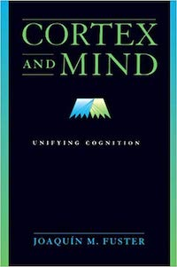

```{r setup, include=F}
knitr::opts_chunk$set(echo = TRUE, fig.align = 'center')
options(knitr.table.format = 'html') # For the html tables
```

<br >

I absolutely love reading and collecting books. Whenever I'm in a phase where I am constantly reading, I feel more creative and confident in my academic work. However, in the busy mix of an academic semester, it's easy to put reading off to the side in lieu of data analysis, writing, and conferences. Below is a live tracker of my reading progress (I'm trying for 20 pages per day) to help motivate me to read every day. 

Below that I'll list the finished books that have inspired me or have made an impact on my work.

## Reading Progress
<hr >

I'll try to update this weekly:

```{r, message = FALSE, fig.align='center'}
# Packages
library(tidyverse); library(readxl); library(plotly)

# Importing reading data
reading_data <- read_excel(path = "data/my-reads.xlsx", 
                           sheet = "reading-data"
                           ) %>%
  mutate(date = as.Date(date))
book_list <- read_excel(path = "data/my-reads.xlsx", sheet = "book-list")

# Joinging book list to reading data
rdata <- left_join(reading_data, book_list, by = "book")

# Plotting daily reading progress by pages
pages_plot <- ggplot(rdata, aes(date, pages, color = title)) +
  geom_point(aes(group = author)) +
  geom_line() +
  scale_x_date(date_labels = "%d-%b",
               limits = c(as.Date(Sys.Date() - 5), as.Date(Sys.Date() + 5)),
               date_breaks = "1 day",
               date_minor_breaks = "1 day"
               ) +
  coord_cartesian(ylim = c(0, 40)) +
  theme_minimal() +
  theme(legend.position = "none")

ggplotly(pages_plot)
```

## My Favorite Reads
<hr >

Here's a list of books that have heavily influenced my work one way or another. I welcome any suggestions to add to my reading list! Just leave a comment below.

<br >

```{r, echo=FALSE, message=FALSE, fig.align='default'}
# In case you need for the future
# images <- c("images/cortex-and-mind-fuster.jpg", 
#             "images/memory-cerebral-cortex-fuster.jpg"
#             )
# knitr::include_graphics(images)
```




+ __Cortex and Mind: Unifying Cognition__ | __Memory in the Cerebral Cortex: An Empirical Approach to Neural Networks in the Human and Nonhuman Primate__ _Joaquin Fuster_

The ideas, theories, and explanations that Dr. Fuster explicates in these books are a perfect blend of memory, cognitive pyschology, neuroscience, and neuropsychology. As a cognitive neuroscientist interested in frontal lobe function, these books provided me a solid foundation for my work, especially my dissertation project.

<br >

```{r, echo=FALSE, message=FALSE}
knitr::include_graphics("images/model-comp-judd.jpg")
```

+ __Data Analysis: A Model Comparison Approach to Regression, ANOVA, and Beyond (Third Ed.)__ _Charles M. Judd, Gary H. McClelland, & Carey S. Ryan_

Although I felt I received a good education when it came to regression, I wish I had come across this book sooner! The way Judd, McClelland, & Ryan explain regression and its extensions make complete sense to me. These techniques revitalized the way I perform and think about analyses. I highly recommend!

<br >


+ __The Visual Display of Quantatative Information__ | __Visual Explanations__ | __Envisioning Information__ _Edward R. Tufte_

Across these three books, I fell in love with the process of data visualization and all the different ways one can clearly and effectively tell a story through data. I immediately began to re-think the way I visualize my data and implement Tufte's principles in my own work.

<br >

```{r, echo=FALSE, message=FALSE}
knitr::include_graphics("images/ggplot2-wickham.jpg")
```

+ [__Ggplot2: Elegant Graphics for Data Analysis__](https://github.com/hadley/ggplot2-book) _Hadley Wickham_

I highly recommend reading this, from front to back, before creating another plot in R. ggplot2 is an indespensible tool in any data scientist's repetoire for understanding and visualizing his or her data. Part III was especially informative for my own work and gave me plenty of ideas to explore.

<br >

```{r, echo=FALSE, message=FALSE}
knitr::include_graphics("images/disc-stats-field.jpg")
```

+ __Discovering Statistics Using R__ _Andy Field_

This was my introduction into R that really got me from a slow, painful crawl to a full on sprint into data processing and analysis. Although I would still recommend this book, new developments and packages in the R community have changed the landscape entirely. I additionally encourage beginners to read the free [__R for Data Science__](https://r4ds.had.co.nz/) by _Garrett Grolemund_ and _Hadley Wichkam_.


