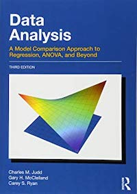

```{r setup, include=F}
knitr::opts_chunk$set(echo = TRUE)
options(knitr.table.format = 'html') # For the html tables
```

<br >

I absolutely love reading and collecting books. Whenever I'm in a phase where I am constantly reading, I feel more creative and confident in my academic work. However, in the busy mix of an academic semester, it's easy to put reading off to the side in lieu of data analysis, writing, and conferences. Below is a live tracker of my reading progress (I'm trying for around 20 pages per day) to help motivate me to read every day. I'll do my best to update this weekly.

## Reading Progress
<hr >

```{r, message = FALSE, fig.align='center'}
# Packages
library(tidyverse); library(readxl); library(plotly); library(httr)

# Importing reading data
# From: https://community.rstudio.com/t/read-xlsx-from-github/9386/3
# See the above link for how I got the code to read in 
# an Excel file into R from Github
github_link <- "https://github.com/mkmiecik14/mkmiecik14.github.io/blob/master/data/my-reads.xlsx?raw=true"
temp_file <- tempfile(fileext = ".xlsx")
req <- GET(github_link, write_disk(path = temp_file))

# Reading data (updated to github on my end)
reading_data <- readxl::read_excel(temp_file, sheet = "reading-data") %>%
  mutate(date = as.Date(date))

# Book list (updated to github on my end)
book_list <- read_excel(temp_file, sheet = "book-list")

# Joinging book list to reading data
rdata <- left_join(reading_data, book_list, by = "book")

# Plotting daily reading progress by pages
pages_plot <- ggplot(rdata, aes(date, pages, color = title)) +
  geom_point(aes(group = author)) +
  geom_line() +
  scale_x_date(date_labels = "%d-%b",
               limits = c(as.Date(Sys.Date() - 5), as.Date(Sys.Date() + 5)),
               date_breaks = "1 day",
               date_minor_breaks = "1 day"
               ) +
  coord_cartesian(ylim = c(0, 40)) +
  labs(x = paste0("date (last updated: ", format(Sys.Date(), "%d-%b-%Y"), ")")) +
  theme_minimal() +
  theme(legend.position = "none")

# Converts to plotly and plots it
ggplotly(pages_plot)
```

## My Favorite Reads
<hr >

Here's a list of books that have heavily influenced my work one way or another. I'm sure there are plenty more that I haven't thought of, but I'll add them along the way.

What are your favorite books and why? I'd love to know if you have any recommendations of books I should read and add to my list! Just leave a comment below.

<br >


+ __Cortex and Mind: Unifying Cognition__ | __Memory in the Cerebral Cortex: An Empirical Approach to Neural Networks in the Human and Nonhuman Primate__ _Joaquin Fuster_

The ideas, theories, and explanations that Dr. Fuster explicates in his books serve as an excellent framework for understanding the interaction between the cerebral cortex and our environment. __Memory in the Cerebral Cortex__ provides a nice introduction to Dr. Fuster's theory of cortical memory and the perception action cycle, while drawing from primate and human studies. __Cortex and Mind__ expands these ideas and breaks the discussion into chapters on cognitive functions like memory, language, perception, working memory (attention), and intelligence.

<br >

```{r, echo=FALSE, message=FALSE}

```

+ __Data Analysis: A Model Comparison Approach to Regression, ANOVA, and Beyond (Third Ed.)__ _Charles M. Judd, Gary H. McClelland, & Carey S. Ryan_

Judd, McClelland, and Ryan describe regression gradually, with each chapter building on the next, in an easy to understand way. The model comparison approach to regression and its various extensions (e.g., single predictor, non-linear, repeated measures, mixed-effects models, etc.) taught in this book helped me grasp regression at a deeper level. I highly recommend, especially if you already have some experience using regression.

<br >


+ __The Visual Display of Quantatative Information__ | __Visual Explanations__ | __Envisioning Information__ _Edward R. Tufte_

Across these three books, I fell in love with the process of data visualization and all the different ways one can clearly and effectively tell a story through data. I immediately began to re-think the way I visualize my data and implement Tufte's principles in my own work. I especially appreciated the guidance in using color in data viz. For instance, using color palettes that we are accustomed to seeing everyday, such as the gradient of colors seen at sunrise and sunset, help elucidate patterns in a natural and ingenious way.

<br >

```{r, echo=FALSE, message=FALSE}
knitr::include_graphics("images/ggplot2-wickham.jpg")
```

+ [__Ggplot2: Elegant Graphics for Data Analysis__](https://github.com/hadley/ggplot2-book) _Hadley Wickham_

I highly recommend reading this, from front to back, before creating another plot in R. ggplot2 is an indespensible tool in any data scientist's repetoire for understanding and visualizing his or her data. Part III was especially informative for my own work and gave me plenty of ideas to explore. For instance, the comination of using the `broom` package and plotting the regression results to explore between and within models deepened my understanding of the relationship between data analysis and data visualization.

<br >

```{r, echo=FALSE, message=FALSE}
knitr::include_graphics("images/disc-stats-field.jpg")
```

+ __Discovering Statistics Using R__ _Andy Field_

This was my introduction into R that really got me from a slow, painful crawl to a full on sprint into data processing and analysis. Although I would still recommend this book, new developments and packages in the R community have changed the landscape entirely. I additionally encourage beginners to read the free [__R for Data Science__](https://r4ds.had.co.nz/) by _Garrett Grolemund_ and _Hadley Wichkam_.

<br >

<!-- disqus START -->

<div id="disqus_thread"></div>
<script>
/**
*  RECOMMENDED CONFIGURATION VARIABLES: EDIT AND UNCOMMENT THE SECTION BELOW TO INSERT DYNAMIC VALUES FROM YOUR PLATFORM OR CMS.
*  LEARN WHY DEFINING THESE VARIABLES IS IMPORTANT: https://disqus.com/admin/universalcode/#configuration-variables*/
/*
var disqus_config = function () {
this.page.url = 'https://mattkmiecik.com/post-My-Reads.html';  // Replace PAGE_URL with your page's canonical URL variable
this.page.identifier = 'post-My-Reads'; // Replace PAGE_IDENTIFIER with your page's unique identifier variable
};
*/
(function() { // DON'T EDIT BELOW THIS LINE
var d = document, s = d.createElement('script');
s.src = 'https://mattkmiecik.disqus.com/embed.js';
s.setAttribute('data-timestamp', +new Date());
(d.head || d.body).appendChild(s);
})();
</script>
<noscript>Please enable JavaScript to view the <a href="https://disqus.com/?ref_noscript">comments powered by Disqus.</a></noscript>

<!-- disqus END -->

