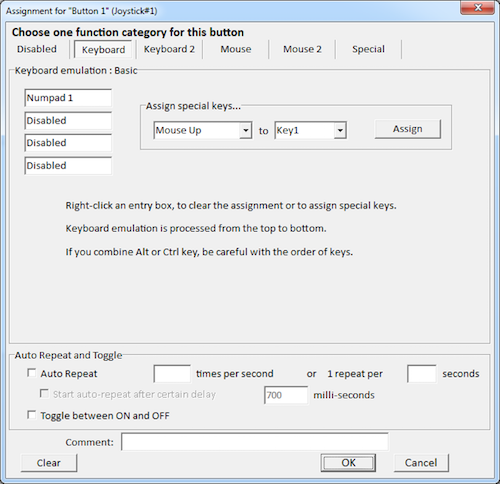
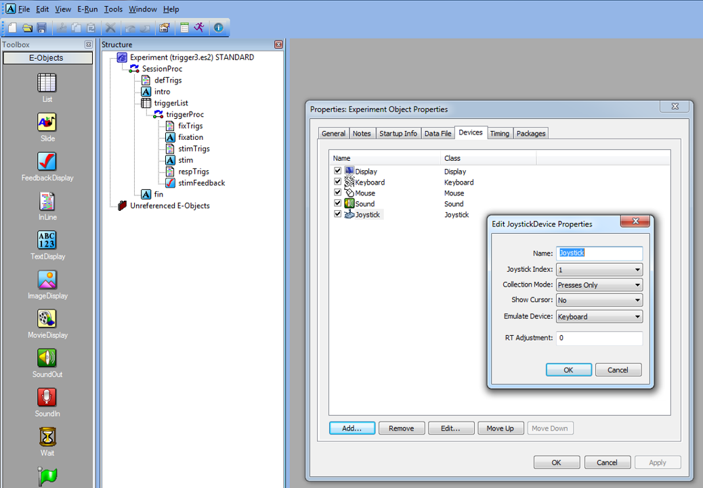
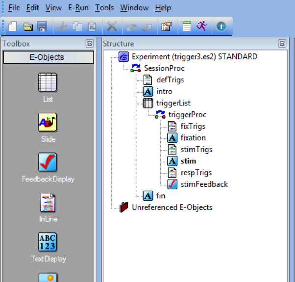
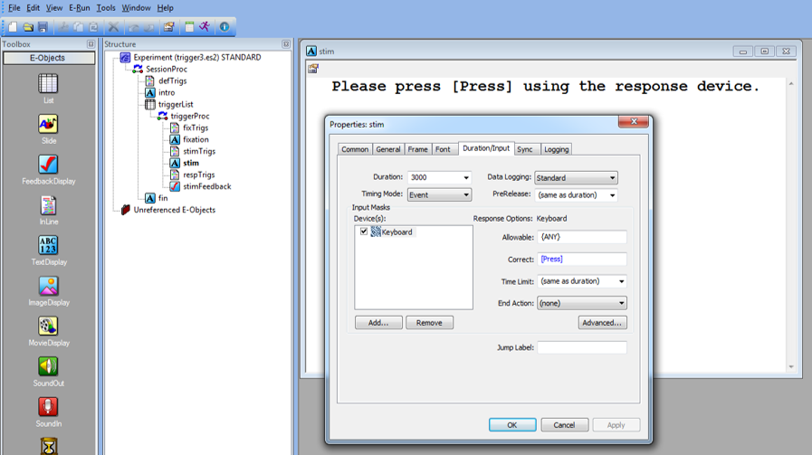

```{r setup, include=FALSE}
library(knitr)
knitr::opts_chunk$set(echo = TRUE)
options(knitr.table.format = 'html') # For the html tables
```

# Introduction

I just spent an entire week wrangling the E-Prime beast and I've lived to tell the tale. I was able to successfully integrate an Xbox controller to accept participant responses as well as communicate these to an EEG system as triggers. This wouldn't have been possible without the help of benevolent bloggers and discussions on E-Prime's Google group, so thank you all! I'll point out these information sources along the way.

I've programmed a simple experiment that checks the passing of triggers to a local EEG system that is available for download here. My general software/hardware specifications:

1. E-Prime 2.0 Standard (2.0.10.356)
2. PC: Windows 8.1 Pro (2GB RAM, 32-bit OS)
3. EEG: ANT neuro [eego](https://www.ant-neuro.com/products/eego-mylab) [mylab](https://www.ant-neuro.com/products/eego-mylab) EEG amplifier

# Xbox Controller with E-Prime

1) Plug the Xbox controller into a USB drive on the same computer that will be running your E-prime experiment. If this is the first time plugging it in, allow Windows to install the necessary drivers. 

2) Download a program that will allow you to map the buttons on the Xbox controller to keyboard keystrokes. I recommend the program [JoyToKey](http://joytokey.net/en/). Once downloaded, open JoyToKey with the Xbox controller still plugged in and modify or create a new profile. In the right pane, click on the button that you would like to assign a keyboard keystroke to and then click "Edit button assignment". If you are unsure which controller buttons correspond to the numberic buttons (e.g., Button 1), then type "joy.cpl" into the Windows search bar (see [here](https://www.howtogeek.com/241421/how-to-calibrate-your-gaming-controller-in-windows-10/)) and then click "Properties". The buttons on this window will light up when pressed, indicating the numneric button assignments.


3) Assign the necessary buttons to specific keystrokes in JoyToKey by clicking the "Edit button assignment" and then simply pressing the intended keystroke on the keyboard. Click OK to save the assignment. For this experiment, I assigned A (Button 1) to Numpad1 and B (Button 2) to Numpad2.



4) To get E-Prime to recognize controller button presses requires adding a Joystick device. To do this, double click on Experiment (filename.es2) or Edit > Experiment. Click on Devices > Add... > select Joystick. Double click on Joystick in the Devices tab to edit its properties to Emulate Device: Keyboard. See [here](https://www.pstnet.com/support/kb.asp?TopicID=1249) for documentation and sample inline code for joystick functions.



E-Prime will now recognize the button presses on the controller as keystrokes. This allows experiments to be programmed as usual, as long as the controller buttons are mapped to appropriate keystrokes (thank you [Ben](https://groups.google.com/forum/#!topic/e-prime/-Kdb0qG83-0) for the idea). You can even emulate the controller as a mouse (see [here](https://www.pstnet.com/support/kb.asp?TopicID=1249)). To do this, edit the joystick properties (see step 4 above) to "Show Cursor: yes: and include the following inline code at the beginning of your experiment:

```vbs
Joystick.AttachToMouseCursor = True
```

# EEG Triggers

It is crucial for those studying event-related potentials (ERPs) that the stimulus computer communicates time-locked onsets and responses from E-prime to the EEG recording. There are several ways this can occur, but the one I will be demonstrating is using a parallel port communication from the E-prime stimulus computer to the amplifier (*Note:* this will differ from system to system). Triggers are then embedded into the recorded EEG signal and read into the recording software as events. Let's use a simple experiment to demonstrate sending triggers for the appearance of stimulus events, as well as participant responses. The experiment is available for download here.

In this experiment participants are presented with a fixation cross and then prompted to press either "1" or "2". Participants receive feedback regarding the accuracy and reaction time of their response across 10 trials. Here is an image of the experiment structure:



Several methods of passing triggers will be demonstrated, including global variables, List Attributes, onset/offset signaling, and WritePort commands.

## Determining the parallel port

PST provides very good instructions for determining the port address that will be used to pass your triggers that depend on your requirements (see [here](https://www.pstnet.com/eprimelegFAQ.cfm#12)). I'll briefly demonstrate with the parallel port on my PC.

Navigate to your PCs Control Panel > Hardware and Sound > Device Manager > Ports (COM & LPT) > Printer Port (LPT) > right click and select Properties > Resources tab. The address on my computer is 0378, and that translates to &H378. I will use this parallel port address in E-Prime to send triggers to the EEG computer.

## Onset/Offset signaling

This type of signaling is the most appropriate to trigger the onset of an event (e.g., fixation cross or stimulus). I'll demonstrate these using the Onset/Offset inline codes mixed with List Attributes. First, let's take a look at "triggerList":

```{r triggerList, echo=FALSE}
# Table
rm(list=ls())
triggerList <- data.frame(ID = 1:10,
                          Nested = rep('', 10),
                          Procedure = rep('triggerProc'),
                          Press = c(1,1,2,2,1,2,2,2,1,2),
                          stimTrig = c(11,11,22,22,11,22,22,22,11,22),
                          fixationTrig = rep(9, 10))
library();library(kableExtra)
kable(triggerList) %>% 
  kable_styling(bootstrap_options = c('striped', 'hover', 'responsive'))
  
```

In this experiment, 9 will denote the onset of a fixation cross (fixationTrig), 11 will denote the onset of the "Press 1" condition stimulus, and 22 will denote the onset of the "Press 2" condition stimulus. Accuracy will be determined via the "Press" column.

The basic concept is that a trigger will be passed at the onset of a stimulus, but must be reset to zero to toggle between triggers.

To pass the fixation crosss trigger (9), the following inline code should be placed before the fixation cross TextDisplay (in this example "fixTrigs"):

```vbs
' Triggers for fixation onset
fixation.OnsetSignalEnabled = True
fixation.OnsetSignalPort = &H378
fixation.OnsetSignalData = c.GetAttrib("fixationTrig")

' Triggers for fixation offset
fixation.OffsetSignalEnabled = True
fixation.OffsetSignalPort = &H378
fixation.OffsetSignalData = 0
```

To pass the triggers conditional on the correct stimulus comdition (11 or 22), the following inline code should be placed before the stimulus (in this example "stimTrigs"):

```vbs
' Triggers for stim onset
stim.OnsetSignalEnabled = True
stim.OnsetSignalPort = &H378
stim.OnsetSignalData = c.GetAttrib("stimTrig")

' Triggers for stim offset
stim.OffsetSignalEnabled = True
stim.OffsetSignalPort = &H378
stim.OffsetSignalData = 0
```

## Using WritePort

Passing triggers for participant responses conditional on their accuracy is a little tricky. In other words, I want to pass a trigger, say with a value of "1", if the participant gets the trial correct, and "2" if he or she answers incorrectly. Additionally, I do not want the response to terminate the trial due to potential EEG artifacts from the screen changing so close to the response. 

Thanks go to David McFarlane for a solution to this issue (see [here](https://groups.google.com/forum/#!topic/e-prime/z8PQMH1cf70)). To satisfy the above needs of my experiment, I need to set the following properties of my stim TextDisplay:

* Duration: 3000ms (I'm limiting participants to 3 seconds)
* Input Device: Keyboard
* PreRelease: (same as duration) -- this is very important (see [here](https://groups.google.com/forum/#!topic/e-prime/z8PQMH1cf70))
* Correct: [Press] -- will automatically determine accuracy
* Time Limit: (same as duration)
* End Action: (none) -- this will not terminate the stimulus



The basic concept for this is that as soon as "stim" is presented on screen, we must program E-Prime to constantly look for a response. If one is detected, send triggers as soon as possible given the trial accuracy (i.e., 1 = correct, 2 = incorrect).

To do this I slightly modified David McFarlane's script and placed it as an inline code following stim called "respTrigs":

```vbs
Do While stim.InputMasks.IsPending()
  Sleep 2 ' Will check every 2ms
Loop

If Len(stim.RESP) > 0 Then
  
  If stim.Acc = 1 Then
  
    Debug.Print "Got it right!"
    WritePort &H378, cor ' Signals correct
  
  Else
    
    Debug.Print "Got it wrong!"
    WritePort &H378, icor ' Signals incorrect
    
  End If
  
Else

  Debug.Print "No Response!"
  WritePort &H378, nrp ' Signals no response
  
End If

Sleep 10 'Takes a break before resetting port

' Reserts port
WritePort &H378, 0
```

Alternatively, if there are no events that require triggers following "stim", "Sleep 10" could be removed and "WritePort &H378, 0" could be placed as the first line of code in the "fixTrigs" inline code.

The variables cor, icor, and nrp were set as [global variables](https://www.pstnet.com/support/kb.asp?TopicID=3844) to be easily modified and stay consitent across the experiment:

```vbs
Dim cor   As Integer
Dim icor  As Integer
Dim nrp   As Integer
```

And then defined at the beginning of the experiment in the inline code "defTrigs":

```vbs
cor   = 1
icor  = 2
nrp   = 3
```

# Timing Considerations

As a disclaimer, I have not had the chance to test the timing of the triggers and responses from the Xbox controller. This was my first time programming the use of a game controller as well as triggers using the InputMasks.IsPending() method.

Please comment or shoot me an email (mkmiecik14@gmail.com) if you have any input regarding the approaches outlined above, especially in regards to timing accuracy tests.

<!-- disqus START -->

<div id="disqus_thread"></div>
<script>
/**
*  RECOMMENDED CONFIGURATION VARIABLES: EDIT AND UNCOMMENT THE SECTION BELOW TO INSERT DYNAMIC VALUES FROM YOUR PLATFORM OR CMS.
*  LEARN WHY DEFINING THESE VARIABLES IS IMPORTANT: https://disqus.com/admin/universalcode/#configuration-variables*/
/*
var disqus_config = function () {
this.page.url = 'https://mkmiecik14.github.io/post-Using-Xbox-Controllers-and-Sending-EEG-Triggers-with-E-Prime.html';  // Replace PAGE_URL with your page's canonical URL variable
this.page.identifier = 'post-Using-Xbox-Controllers-and-Sending-EEG-Triggers-with-E-Prime'; // Replace PAGE_IDENTIFIER with your page's unique identifier variable
};
*/
(function() { // DON'T EDIT BELOW THIS LINE
var d = document, s = d.createElement('script');
s.src = 'https://mattkmiecik.disqus.com/embed.js';
s.setAttribute('data-timestamp', +new Date());
(d.head || d.body).appendChild(s);
})();
</script>
<noscript>Please enable JavaScript to view the <a href="https://disqus.com/?ref_noscript">comments powered by Disqus.</a></noscript>

<!-- disqus END -->